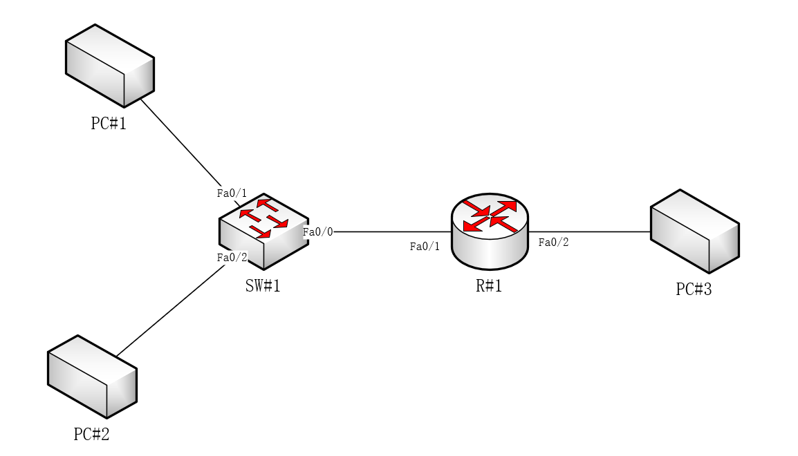
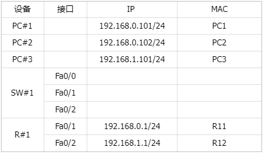

# 清水河网管会 2024 招新题目

## 注意事项

1. 我们希望各位尽力而为。招新题目更多考验的是您的学习能力，但以填满答卷为目的，大量粘贴搜索到的原文、翻译软件和生成式AI输出的内容是不受欢迎的。
2. 如果有余力的话，可以自行拓展一下与题目相关的知识，这样可能有助于您在面试时有更好的发挥。
3. 我们接受两种方式提交的答卷，并以最新收到的有效答卷为准。  
   **请在答卷开头注明您的 (a) 姓名 (b) 学号 (c) QQ号，并将答卷命名为 `学号-姓名.pdf`**  
   a. 直接将PDF格式的答卷提交至 netunion@netunion.org  
   b. 参见“Optional：PGP 加密的使用”（加分项）

### 时间安排

（若有更新，将会在群内发布）

- 预计答卷提交在 9 月 18 日 12:00 截止（在这之后您或仍可提交答卷，但不保证能为您安排面试）；
- 面试通知会在结束答卷审核后通过 QQ 单独通知到您

### 许可证

本作品采用知识共享署名 4.0 国际许可协议进行许可。  
要查看该许可协议的副本，请访问 http://creativecommons.org/licenses/by/4.0/  
或者写信到 Creative Commons, PO Box 1866, Mountain View, CA 94042, USA。

## 六期公寓上网指南测试

> 参考：[六期公寓上网指南（中文）](https://netunion.org/2024/uestc-internet/)

1. 假如您是本科生，请问六期公寓的校园网接入方式与您所在组团的校园网接入方式是否相同？假如相同，请说明原因。
2. 请问如何区分路由器上的WAN口和LAN口？
3. 假如您是六期公寓最近才入住的新生，当您第一次使用宿舍网络的时候，应该进行哪些必要操作？
4. 假如您居住在六期公寓，请问以下哪种情况需要立即报修 (多选)  
  A. 配电箱光猫指示灯不亮  
  B. 路由器的WAN口已正确连接到墙面网口，也将路由器配置为DHCP模式，但路由器提示无法获取IP地址  
  C. 在校园网登录页面输入了正确的账号和密码，点击登陆后显示Charge Overdue
5. 指南中提及代理会影响到校园网的登录，请分析代理是如何影响到校园网登录的？（开放性问答）

## 交换与路由

某网络拓扑如图所示，据此回答下列问题。

已知所有设备刚刚连接完成，并按下表配置好IP地址，尚未发生任何通信，问：

1. 在不加任何其他配置的情况下，PC#1 能否 ping 通 PC#3？如可以，请说明理由，如不能，请给出解决方案。
2. 在不加任何其他配置的情况下，PC#1 向 PC#2 发送一个 ICMP Echo Request 分组，并收到响应。请写出此时 SW#1 的 MAC 表内容。
3. 通过一定的配置，PC#1 可以 ping 通 PC#3。请写出 PC#1 与 R#1 的 ARP 表内容，以及 SW#1 的 MAC 表内容。
4. 请问家庭常用的“路由器”包含哪些网络功能？可按OSI模型分层叙述。

## Optional：PGP 加密的使用

作为一个加分项，您可以将 PDF 格式的答卷通过 PGP 签名并加密后提交到我们的邮箱（netunion@netunion.org）。  
您可将自己提交的文件通过 PGP 签名并加密，具体来说：

1. 需要将您的密钥提交到 hkps://keyserver.netunion.org
2. 从上面的 keyserver 获取 NetUnion <netunion@netunion.org> 的证书（指纹：67D5CDC3527851F37028CEDC2F54617111CAE56E）的加密密钥
3. 将文件以您的密钥进行签名，且以 NetUnion <netunion@netunion.org> 作为收件人加密
4. （Optional）对此密钥进行认证，并公开此认证

> **【!】**若您使用软件的方式上传密钥，**请务必保证您正确地设置了 keyserver！**  
> 在招新结束后，此 keyserver 会被清空（同时此 NetUnion 的密钥也会不可用），因此不成熟的证书也是可以接受的，但是如果您提交到了公共的 keyserver 上，可能会造成很多不必要的麻烦。
